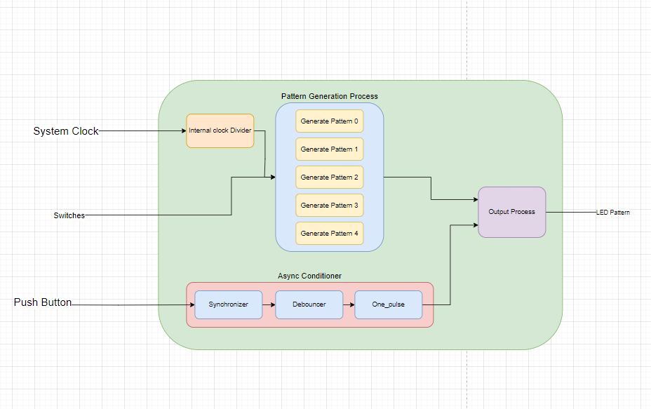

# Lab 4 : LED Pattern Generation on DE10-Nano

## Overview 
Create a System on the DE10-nano to produce Variious LED Patterns based on dip switches and button input from the user. 

## Deliverables

# Lab Report

## Project Overview
The Goal of this lab was to create a VHDL project that allowed the user to choose between 5 different LED blinking patterns. The user uses the switches and button to interact with the FPGA and set the outputs. The differnt blinking patterns each have their own unique cycle time which is a scaler value of the base rate which is passed in as a fixed point value representing the period of the base rate. 

## System Architecture 

### System Block Diagram

### State Diagram

 For System Layout see [System Description](./assets/led_patterns.html)

 The state diagram allows for transitions from idle to holding the input of the switches and displaying that input on the LEDs for a second when the button is pressed. Then it transitions to the input state from the switches. Each state has its own unique timer that when asserted adjusts the output to the LEDs.

 ## Implementation Details
 The unique pattern created alternated toggling every other bit on the leds at a rate of 3 times the base rate of the clock. It appears that the light is shifting left and right reapeatedly. 
